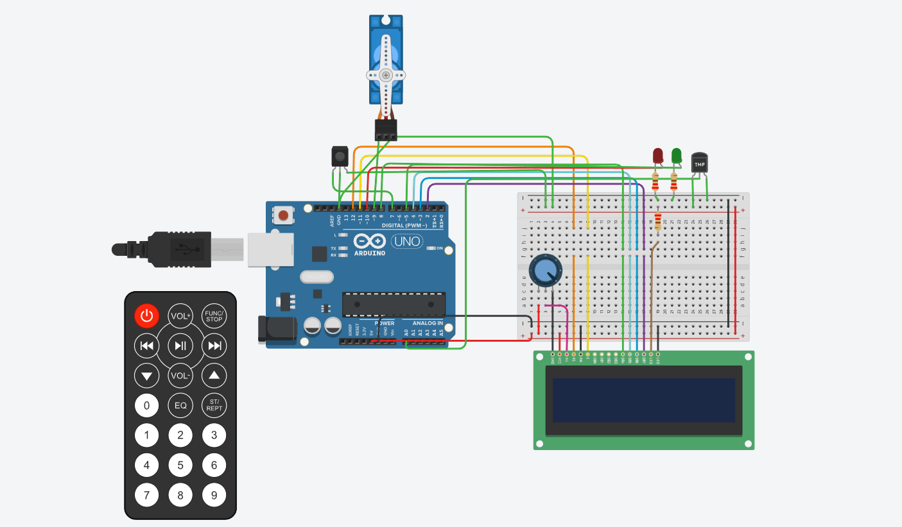

# Segundo Parcial SPD

## Integrantes 
- Juan Manuel Mosquella 

## Descripción
Se inicilizan las librerias correspndientes y se toma la temperatura del LCD constatemente para determinar la estacion del año. Dependiendo si la temperatura excedio el limite se prendera el servo y el led rojo.

## Funciónes
Esta funcion se encarga de encender y apagar los leds.

B0, B1, B2, B3 son #define que utilizamos para agregar los leds, asociandolo a pines de la placa arduino.

(Breve explicación de la función)

~~~ C (lenguaje en el que esta escrito)
float take_temp(int sensor) {
  int lectura = analogRead(sensor);
  float temp = map(lectura, 20, 358, -40, 125); 
  return temp;
}

void changeState(){
  running = !running;
}

void TurnOnTurnOffLCD(bool running){
  if (running){
    
    for (int pos = 0; pos <= 180; pos++) {
      servo.write(pos);    
    
    }   
    
    float temp = take_temp(A0);
   
    season = checkSeason(temp);
    
    
    lcd_1.setCursor(1, 0);
    lcd_1.print(season);
   
    lcd_1.setCursor(0, 1);
   
    lcd_1.print(temp);
    delay(1000);
  }
  else{   
    
    lcd_1.clear();
  }  
}

String checkSeason(float temp){
 
  if ( temp <= 60){
    season = "Verano";
  }
  else if (temp <= 20 ){
    season = "Otonio";
  }
  else if (temp <= 15){
    season = "Primavera";
  }
  else if (temp <= 10){
    season = "Invierno";
  }
   else if (temp >= 60){
    season = "Incendio";
    
  }
  
  return season;
}

void TurnOnOffServo(){
  
  Serial.println(season);
 
  if (season == "Incendio"){
     servo.attach(9);
     servo.write(180);
    
  }
  else {
    servo.detach();
  }
}

void TurnOnOffLed(){
  if (season == "Incendio"){
    digitalWrite(LED_ROJO, HIGH);
    digitalWrite(LED_VERDE, LOW);
  }
  else{
     digitalWrite(LED_VERDE, HIGH);
    digitalWrite(LED_ROJO, LOW);
  }
  
}

~~~

## :robot: Link al proyecto
- [proyecto](https://www.tinkercad.com/things/iGt1vfQsb6Z-stunning-gaaris-krunk/editel?sharecode=sHoOaI4jhO7y2fHUF_WvPFkbtHwwwsADMe2r4zDds1A)
## :tv: Link al video del proceso

---

- [Lenguaje Markdown](https://markdown.es/sintaxis-markdown/#linkauto).

- [Markdown Cheatsheet](https://github.com/adam-p/markdown-here/wiki/Markdown-Cheatsheet).

- [Emojis](https://gist.github.com/rxaviers/7360908).

---

